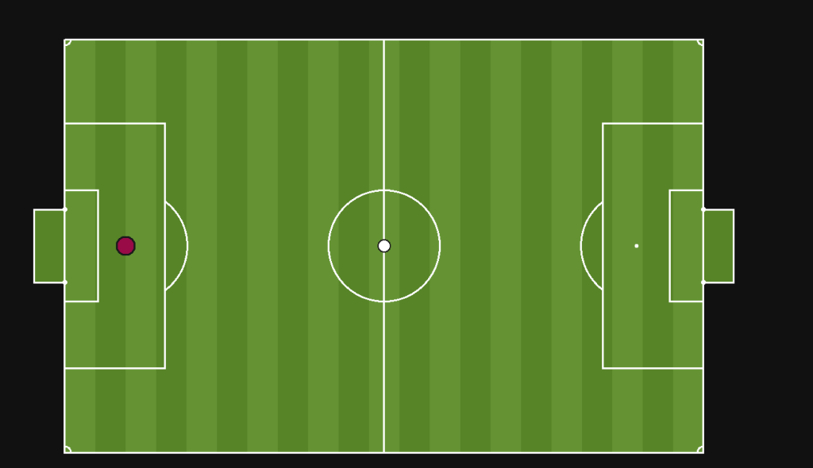
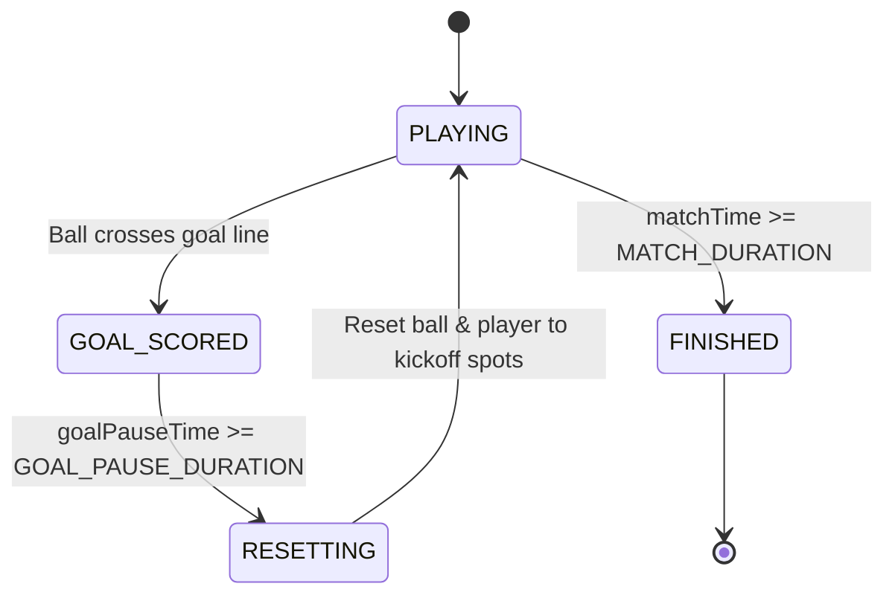

# ⚽ The Ball Game

> A fast-paced, top-down 2D physics soccer game built from scratch in TypeScript, powered by PixiJS for rendering and a headless, zero-dependency physics simulation engine designed for authoritative multiplayer.



---

## 🎯 What is This?

**The Ball Game** is an arcade-style, physics-driven 2D soccer game inspired by classic multiplayer browser games like HaxBall. 

Instead of slapping together a quick prototype inside a monolithic rendering loop, this project is built from first principles:
- **Custom 2D Vector Math & Physics**: Circle-circle elastic collisions, momentum conservation with restitution, directional impulse kicking, and line-segment pitch boundary reflections.
- **Strict Separation of Concerns**: Game logic and physics know **nothing** about PixiJS, canvases, or the DOM. The entire simulation runs headless and communicates via immutable state snapshots.
- **Architected for Multiplayer**: The same simulation running locally in the browser today is built to run identically inside an authoritative Node.js server tomorrow over WebSockets.

---

## 📍 Current Status: Checkpoint 3 Complete

| Checkpoint | Status | Description |
|---|:---:|---|
| **Checkpoint 1** | ✅ | **Core Physics & Kinematics**: Player acceleration/deceleration, ball friction, circle collisions with de-penetration, momentum-conserving impulse resolution, and edge-triggered kicking. |
| **Checkpoint 2** | ✅ | **Pitch & Match Rules**: FIFA-scaled pitch geometry, goal net detection, score tracking, match timer, and match lifecycle states (`PLAYING` $\to$ `GOAL_SCORED` $\to$ `RESETTING` $\to$ `FINISHED`). |
| **Checkpoint 3** | ✅ | **Headless Architecture Split**: Simulation completely divorced from PixiJS. Introduction of `PhysicsBody`, `SimulationSnapshot`, decoupled `PlayerInput`, and dedicated renderers. |
| **Checkpoint 4** | 🚧 *(In Progress)* | **Networking & Multiplayer Plumbing**: Authoritative Node.js server, Socket.io bidirectional connection, client input streaming, and server snapshot broadcasting. |

---

## 🏗️ Architecture & Simulation Pipeline

The defining architectural decision in Checkpoint 3 was splitting the engine into three distinct roles: **Simulation (Model)**, **Renderers (View)**, and **Client Orchestrator (Controller)**.

```
       [ Keyboard / DOM ]
               │
               ▼
      [ PlayerInputReader ]
               │  PlayerInput { move, kick }
               ▼
    ┌──────────────────────┐
    │     Game.update()    │  <--- Pure TypeScript (Headless)
    │  - Kinematics        │       No PixiJS / No DOM / No Canvas
    │  - Collision System  │
    │  - Goal Detection    │
    │  - Match State       │
    └──────────┬───────────┘
               │  SimulationSnapshot (Plain DTO)
               ▼
    ┌──────────────────────┐
    │      GameClient      │  <--- Presentation Bridge
    └──────────┬───────────┘
               │
         ┌─────┴─────┐
         ▼           ▼
   [PlayerRenderer] [BallRenderer]  <--- PixiJS v8 Display Objects
```

### 1. Pure Headless Simulation (`Game.ts`)
The `Game` class has **zero PixiJS imports**. It owns the physical objects, steps time forward by `dt`, checks boundary and body collisions, checks for goals, and returns an immutable **`SimulationSnapshot`**. Because it has no browser dependencies, this exact class can run in Node.js server environments without modification.

### 2. The Data Contract (`SimulationSnapshot.ts`)
Renderers never reach into game entity internals. Instead, the game emits a flat Data Transfer Object (DTO) at the end of every frame:
```typescript
export interface SimulationSnapshot {
    player: { x: number; y: number; vx: number; vy: number };
    ball:   { x: number; y: number; vx: number; vy: number };
    score:  { left: number; right: number };
    timer:  number;
    phase:  GameState;
}
```
This flat structure serves a dual purpose:
1. **Today**: Tells `PlayerRenderer` and `BallRenderer` where to position sprites on screen.
2. **Tomorrow**: Easily serializable (`JSON.stringify` or binary buffers) to broadcast over a network socket to connected clients.

### 3. Dedicated Renderers (`src/render/`)
`FieldRenderer`, `PlayerRenderer`, and `BallRenderer` extend PixiJS graphics classes. They know only how to draw themselves and expose simple `.sync()` methods to update their visual coordinates based on the snapshot.

### 4. Decoupled Input (`PlayerInput.ts` & `PlayerInputReader.ts`)
Entities do not listen to DOM `KeyboardEvents`. Instead, `PlayerInputReader` samples the raw keyboard listener and translates it into a generic input payload:
```typescript
export interface PlayerInput {
    move: Vector2;
    kick: boolean;
}
```
`Player.update(dt, input)` consumes this interface directly. Whether input comes from local keys or a WebSocket packet over the internet, the player simulation logic behaves identically.

---

## 🔬 Physics & Mechanics Under the Hood

### 1. Ball Friction & Decay
The ball maintains velocity across frames rather than moving on constant player push. Friction is modeled as exponential velocity decay:
$$
\vec{v}_{\text{next}} = \vec{v} \cdot (1 - \mu \cdot dt)
$$
To prevent floating-point micro-drift where the ball crawls at infinitesimal speeds, an $\epsilon$-threshold zeroes the velocity when $|\vec{v}|^2 < \epsilon^2$.

### 2. Circle-Circle Collision & Positional De-penetration
When detecting whether the ball and player collide, calculating square roots ($\sqrt{\Delta x^2 + \Delta y^2}$) every frame is costly. We check distance squared against radius sum squared first:
$$
\Delta x^2 + \Delta y^2 \le (r_{\text{player}} + r_{\text{ball}})^2
$$

If overlapping:
1. **De-penetration**: Calculate true overlap and shift both bodies apart along the collision normal $\hat{n}$ by half the overlap to resolve physical intersection:

   $$
   \vec{x}_{\text{correction}} = \hat{n} \cdot \frac{\text{overlap}}{2}
   $$

2. **Impulse Resolution**: Conserves momentum based on Newton's third law and the coefficient of restitution $e$:

   $$
   J = \frac{-(1 + e)(\vec{u}_1 - \vec{u}_2) \cdot \hat{n}}{\frac{1}{m_1} + \frac{1}{m_2}}
   $$

   Because the player is significantly heavier than the ball ($m_{\text{player}} \gg m_{\text{ball}}$), the ball absorbs the vast majority of the impulse velocity while the player barely flinches.

### 3. Kicking as an Instantaneous Impulse
Kicking is not a sustained force; it's a discrete impulse.
- **Edge-triggered detection**: Requires spacebar to transition from *unpressed* $\to$ *pressed* (preventing kick spamming by holding the key).
- **Proximity validation**: Allowed only when the distance between player and ball is within kick range.
- **Directional Impulse**: Injects an instantaneous velocity boost along the line connecting player center to ball center:
  $$
  \Delta \vec{v}_{\text{ball}} = \frac{\text{Impulse}}{m_{\text{ball}}}
  $$

### 4. Wall & Goal Boundary Physics
- Field boundaries are decomposed into mathematical `LineSegment` primitives.
- Wall collisions find the closest point on the line segment, project the collision normal, de-penetrate the ball, and reflect the velocity vector ($\vec{v}' = \vec{v} - 2(\vec{v} \cdot \hat{n})\hat{n}$) scaled by wall restitution.
- Goal posts are modeled as circular pegs rather than sharp rectangular boxes to yield natural, curved deflections.

---

## ⏱️ Match Lifecycle & State Machine

The game runs a finite state machine inside `Game.update()`:



- **`PLAYING`**: Full physics integration, collision detection, and input processing active.
- **`GOAL_SCORED`**: Physics freezes immediately. Velocities are zeroed to prevent accidental ricochets or double-goal triggers. Score is awarded to the opposing side.
- **`RESETTING`**: Positions snap back to kickoff coordinates, timers reset, and play resumes.
- **`FINISHED`**: Match concludes once the match timer expires.

---

## 📂 Project Structure

```
The-Ball-Game/
├── client/
│   ├── index.html
│   ├── package.json               # PixiJS v8, TypeScript, Vite
│   ├── tsconfig.json
│   ├── public/                    # Favicons and SVG assets
│   └── src/
│       ├── main.ts                # Application bootstrap & Pixi ticker
│       ├── GameClient.ts          # Bridge orchestrating Input -> Game -> Renderers
│       ├── Game.ts                # Pure headless simulation & match orchestrator
│       ├── game/
│       │   ├── GameState.ts       # Match state enum (PLAYING, GOAL_SCORED, etc.)
│       │   ├── GoalDetector.ts    # Geometric goal line detection
│       │   ├── MatchState.ts      # Score counters and timers
│       │   └── SimulationSnapshot.ts # Flat DTO contract between sim & view
│       ├── input/
│       │   ├── Input.ts           # Low-level DOM keyboard listener
│       │   ├── PlayerInput.ts     # Pure input interface definition
│       │   └── PlayerInputReader.ts # Samples Input into PlayerInput
│       ├── math/
│       │   └── Vector2.ts         # Custom 2D vector class
│       ├── objects/
│       │   ├── Ball.ts            # Ball physics state & friction
│       │   ├── Field.ts           # Pitch dimensions & boundary segment geometry
│       │   └── Player.ts          # Player physics state & movement kinematics
│       ├── physics/
│       │   ├── PhysicsBody.ts     # Base class (position, velocity, radius, mass)
│       │   ├── Collision.ts       # Collision contact data
│       │   ├── CollisionSystem.ts # Generic body & boundary resolution
│       │   ├── boundary/          # LineSegment & boundary shapes
│       │   └── geometry/          # Closest-point algorithms
│       └── render/
│           ├── BallRenderer.ts    # PixiJS ball visual sync
│           ├── FieldRenderer.ts   # PixiJS pitch lines, markings & goal nets
│           └── PlayerRenderer.ts  # PixiJS player visual sync
├── docs/
│   └── gameplay.png               # In-game pitch screenshot
└── server/                        # Scaffolding for authoritative multiplayer
```

---

## 🎮 Controls

| Action | Key(s) |
|---|---|
| **Move** | `W`, `A`, `S`, `D` or Arrow Keys |
| **Kick** | `Spacebar` (when near the ball) |

---

## 🚀 Getting Started

### Prerequisites
- [Node.js](https://nodejs.org/) (v18 or higher recommended)
- `npm` or `pnpm`

### Installation & Run

1. **Clone the repository:**
   ```bash
   git clone https://github.com/your-username/The-Ball-Game.git
   cd The-Ball-Game/client
   ```

2. **Install dependencies:**
   ```bash
   npm install
   ```

3. **Start the local development server:**
   ```bash
   npm run dev
   ```

4. **Play:**
   Open the printed local URL (usually `http://localhost:5173`) in your browser.

---

## 💡 Engineering Insights & Lessons Learned

During the transition across Checkpoints 1 through 3, several key architectural lessons emerged:

- **Inheritance vs. Composition for Renderers**: Initially, entities extended Pixi's `Graphics` directly. While quick to start, it tightly coupled physical units with rendering concerns. Decoupling them so that `Player` is pure data and `PlayerRenderer` simply syncs from a snapshot made the simulation testable and portable.
- **The Power of Plain DTOs**: Live class instances with methods and nested circular references cannot be safely stringified or transmitted over network sockets. The `SimulationSnapshot` pattern forced a clean, flat boundary where the simulation exposes only what is true right now.
- **Discrete vs. Continuous Input**: Treating a kick as a continuous state resulted in uncontrollable hyper-acceleration. Treating it as a discrete positive-edge event with a kick radius and cooldown immediately made the mechanic feel deliberate and skill-based.
- **Why WebSockets Over HTTP Polling**: In multiplayer simulations, client-to-server input must stream continuously, and server-to-client state must push unprompted. HTTP polling introduces latency equal to the polling interval and massive header overhead. A persistent WebSocket channel (via Socket.io) enables bidirectional, low-overhead event streaming.

---

## 🗺️ Roadmap

- [x] **2D Vector & Kinematic Physics System**
- [x] **Momentum conservation collisions & impulse kicks**
- [x] **FIFA-proportional pitch geometry and goal validation**
- [x] **Decoupled Headless Simulation (Checkpoint 3)**
- [ ] **Socket.io connection handshake & round-trip verification (Checkpoint 4)**
- [ ] **Authoritative Node.js game server loop with fixed timestep ticks**
- [ ] **Multiplayer room matchmaking & 1v1 / 2v2 support**
- [ ] **Client-side prediction, server reconciliation, and entity interpolation**
- [ ] **Dynamic scoreboard UI, goal celebrations, and instant replay queue**
